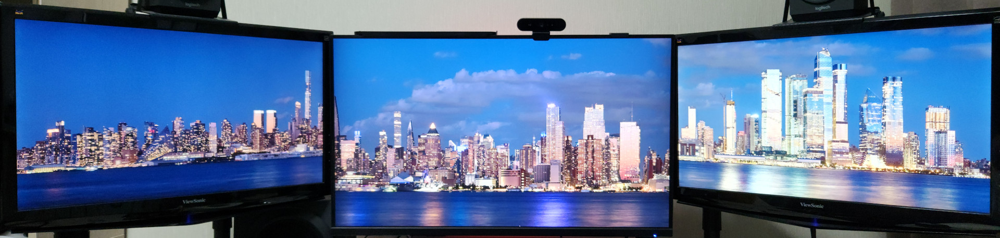
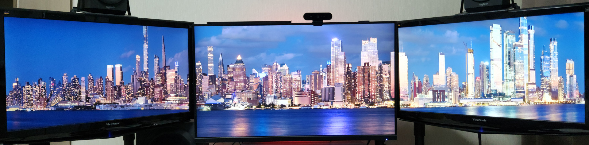
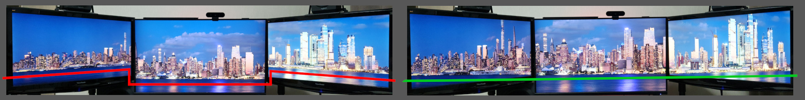
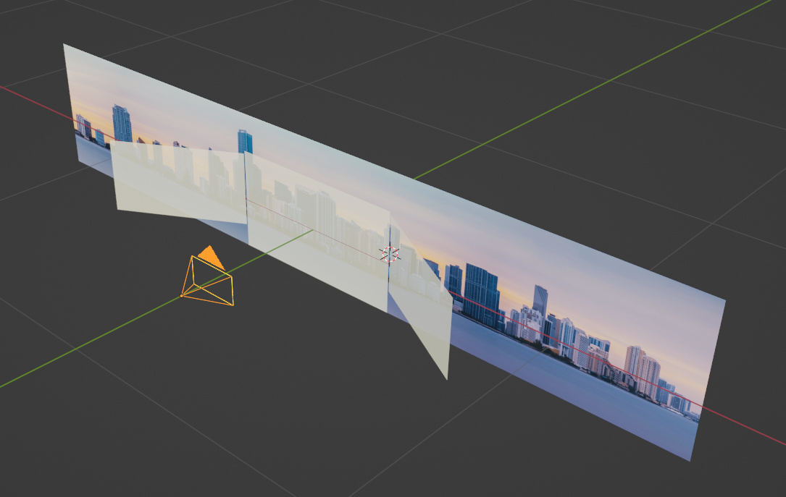

# Multi-monitor wallpaper projector

Generates wallpapers for a multi-monitor<sup>*</sup> setup using a Blender scene.

<sup>*</sup> <small>Currently multi = 3 precisely</small>

## Demo

In a three monitors setup if you try to span a panoramic wallpaper across them, you may get:

**Regular wallpaper span**



As you can see, the shoreline is curved as if it had a trapezoidal shape (or a zigzag as in my case due to
different resolutions), as if it were some kind of bay - even though in reality the shoreline is straight.

Here is a fixed view:

**Properly projected**



**Comparison**



The first view ignores the fact that the side monitors are not coplanar with the
central monitor - instead, they are set at an angle to it.

So we should take into account the specific angles of the displays and correctly project the side images.

Here is what it looks like in blender for my setup:



This model has three monitor planes and a panorama plane used by this repo to setup the scene
for projections.

## Setup

```bash
.venv/bin/pip install opencv-python numpy Pillow
```

## Quick Start

```bash
# 1. Export scene from Blender → scene.json (see scenes/README.md)
# 2. Initialize projection config
python3 init-config.py
# 3. Interactive panorama cropping
python3 crop.py panorama.jpg
# 4. Generate wallpapers for each monitor
python3 wallpaper.py wallpapers/panorama/
# 5. Apply on KDE Plasma
python3 apply-kde-wallpapers.py wallpapers/panorama/
```

## CLI Reference

| Script | Description |
|--------|-------------|
| `init-config.py` | Generate `config.json` from `scene.json` + xrandr |
| `crop.py [--scene] [--dir] <image>` | Interactive cropper (tkinter), saves `crop.json` + `source.jpg` |
| `wallpaper.py [--scene] [--config] [--flat] <project_dir>/` | Generate wallpapers for three monitors |
| `apply-kde-wallpapers.py [--config] [--dry-run] <directory>` | Apply wallpapers via KDE Scripting API |

## Configuration

- `scene.json` — Blender scene geometry
- `config.json` — projection + screenshots (generated by `init-config.py`)

## Output Structure

```
project_dir/
├── source.jpg      # cropped panorama (crop.py output)
├── crop.json       # crop coordinates
├── center.jpg      # center monitor wallpaper
├── left.jpg        # left monitor wallpaper
└── right.jpg       # right monitor wallpaper
```
